# NetMate 系统架构图解 (Mermaid版)

> 本文档使用 Mermaid 语法展示 NetMate 项目的系统架构。
>
> **提示**: 使用支持 Mermaid 渲染的编辑器（如 VS Code + Markdown Preview Mermaid Support）或在线工具（如 [Mermaid Live Editor](https://mermaid.live/)）查看图表。

---

## 目录

1. [整体架构](#1-整体架构)
2. [技术栈](#2-技术栈)
3. [数据流](#3-数据流)
4. [核心服务](#4-核心服务)
5. [平台适配](#5-平台适配)
6. [模块依赖](#6-模块依赖)
7. [状态管理](#7-状态管理)
8. [IPC通信](#8-ipc通信)
9. [心跳检测流程](#9-心跳检测流程)
10. [登录流程](#10-登录流程)

---

## 1. 整体架构

### 1.1 分层架构

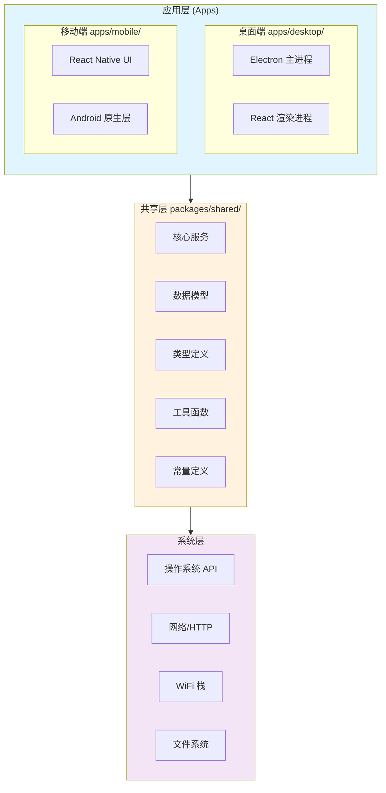

### 1.2 组件交互

```mermaid
flowchart LR
    subgraph UI["UI 层"]
        Home["首页"]
        Settings["设置页"]
        Logs["日志页"]
        Sidebar["侧边栏"]
    end

    subgraph Hooks["React Hooks"]
        useAuth["useAuth"]
        useNetwork["useNetwork"]
        useConfig["useConfig"]
        useLogs["useLogs"]
    end

    subgraph IPC["IPC 通信"]
        AuthIPC["auth:*"]
        AccountIPC["account:*"]
        WifiIPC["wifi:*"]
        NetworkIPC["network:*"]
    end

    subgraph Services["平台服务"]
        Tray["托盘服务"]
        Store["存储服务"]
        Notify["通知服务"]
        WifiDetect["WiFi检测"]
        AutoReconnect["自动重连"]
    end

    subgraph Core["共享核心服务"]
        Auth["AuthService"]
        Network["NetworkDetector"]
        Account["AccountManager"]
        Wifi["WifiManager"]
        Config["ConfigManager"]
        Logger["Logger"]
    end

    UI --> Hooks
    Hooks --> IPC
    IPC --> Services
    Services --> Core

    style UI fill:#e3f2fd
    style Core fill:#fff8e1
    style Services fill:#fce4ec
```

---

## 2. 技术栈

### 2.1 技术栈概览

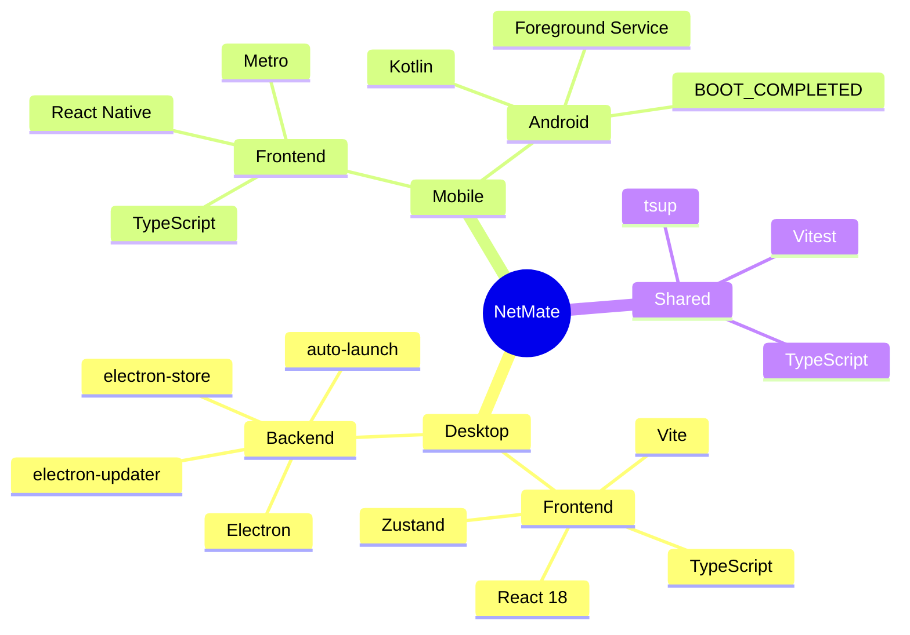

### 2.2 技术选型

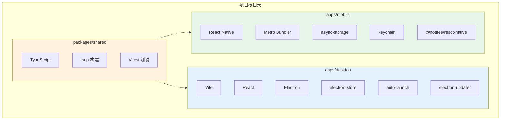

---

## 3. 数据流

### 3.1 数据流架构

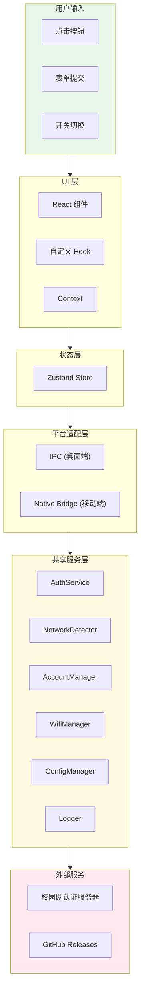

### 3.2 数据流方向

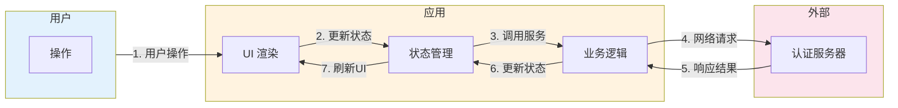

---

## 4. 核心服务

### 4.1 服务类结构

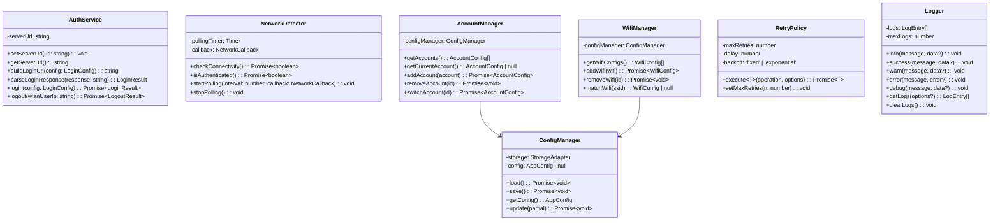

### 4.2 服务关系

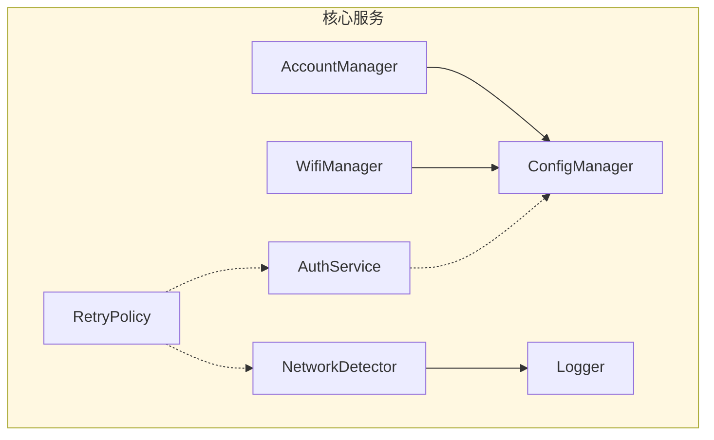

---

## 5. 平台适配

### 5.1 存储适配器

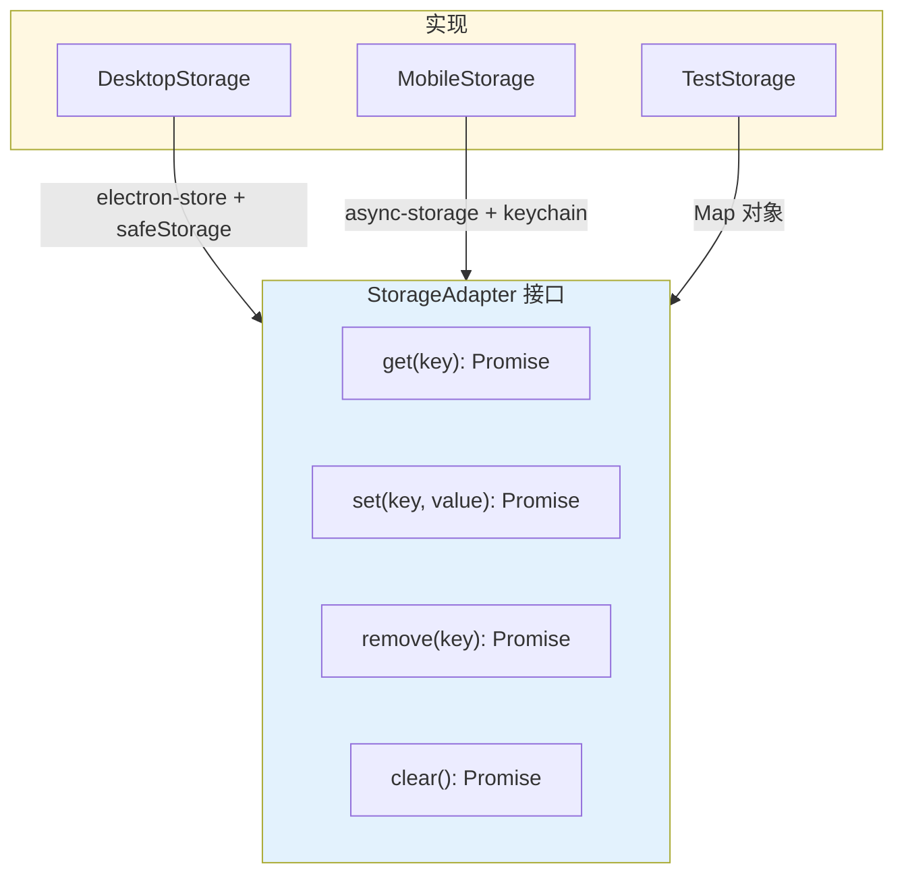

### 5.2 WiFi 适配器

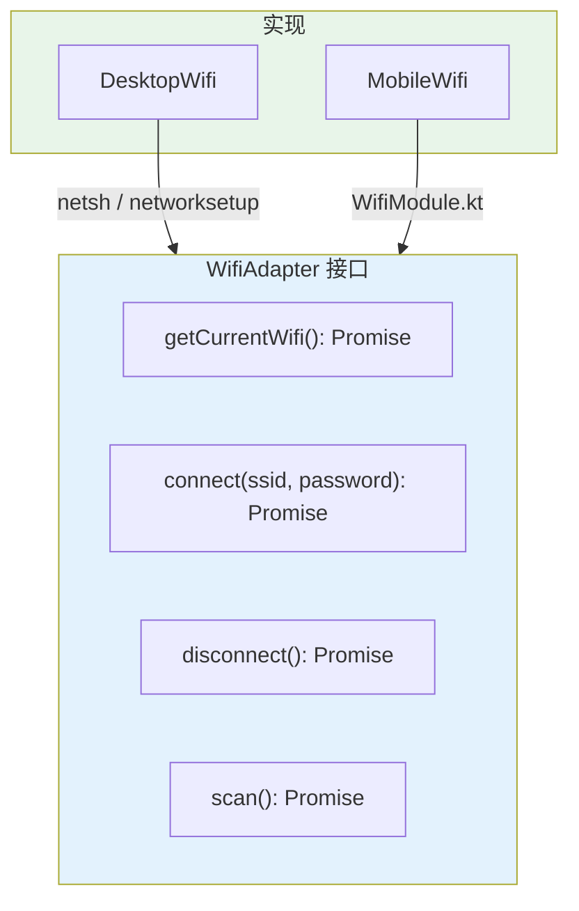

---

## 6. 模块依赖

### 6.1 包依赖关系

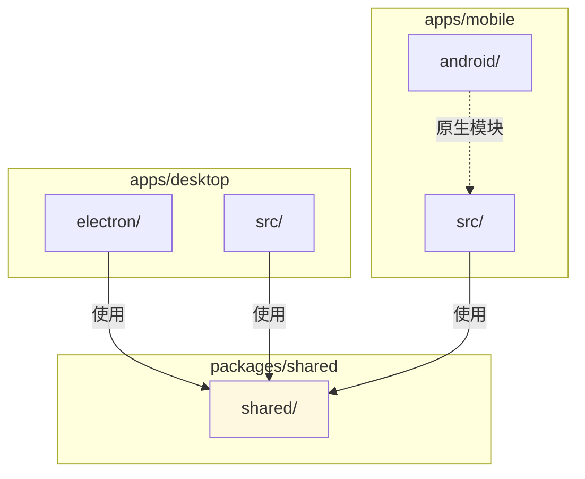

### 6.2 内部依赖

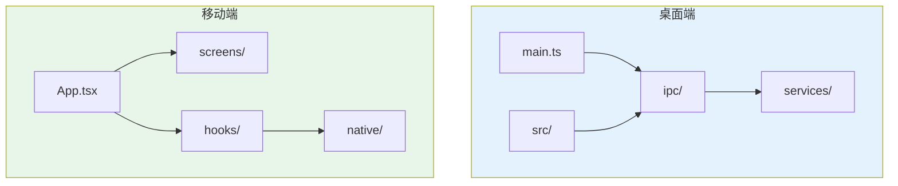

---

## 7. 状态管理

### 7.1 Zustand Store 结构

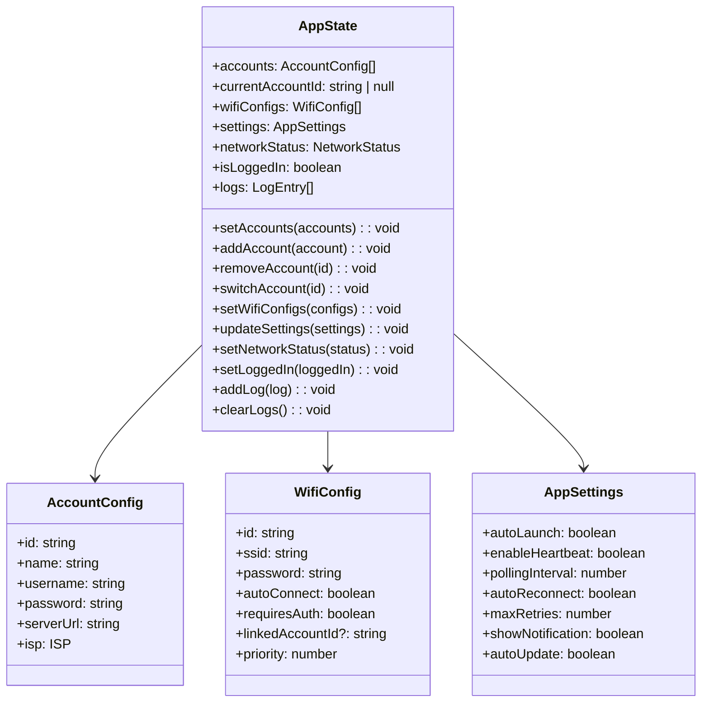

### 7.2 状态流

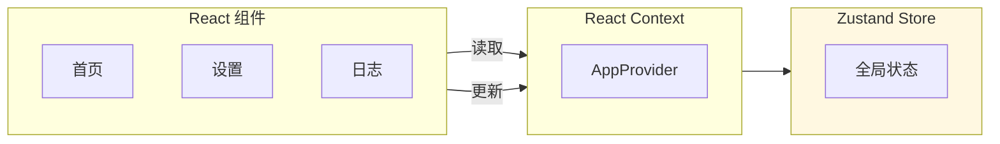

---

## 8. IPC通信

### 8.1 IPC 通道

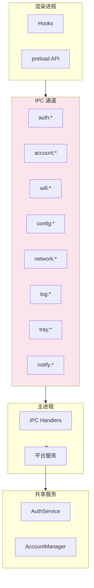

### 8.2 通信流程

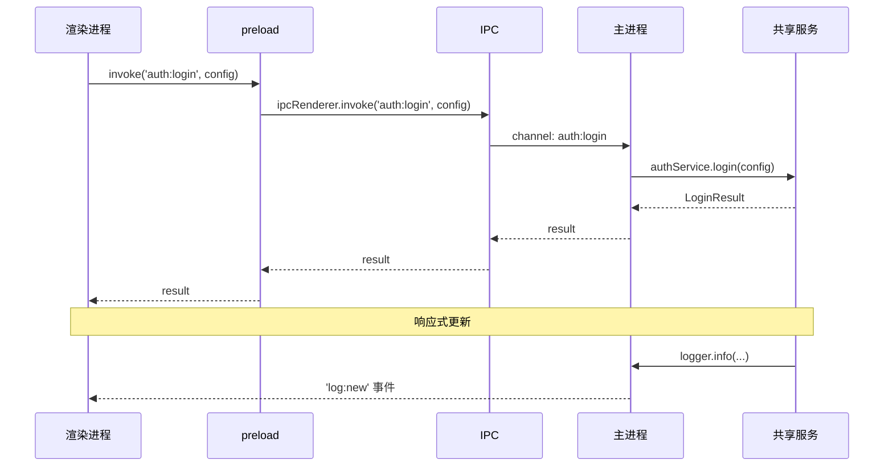

---

## 9. 心跳检测流程

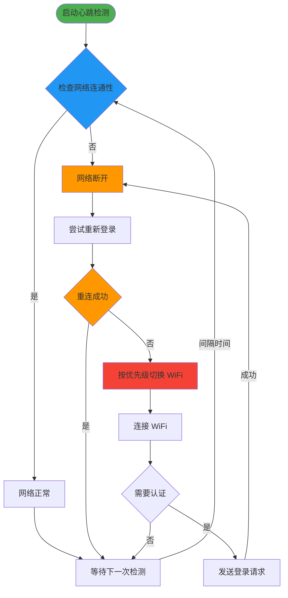

---

## 10. 登录流程

### 10.1 登录序列图

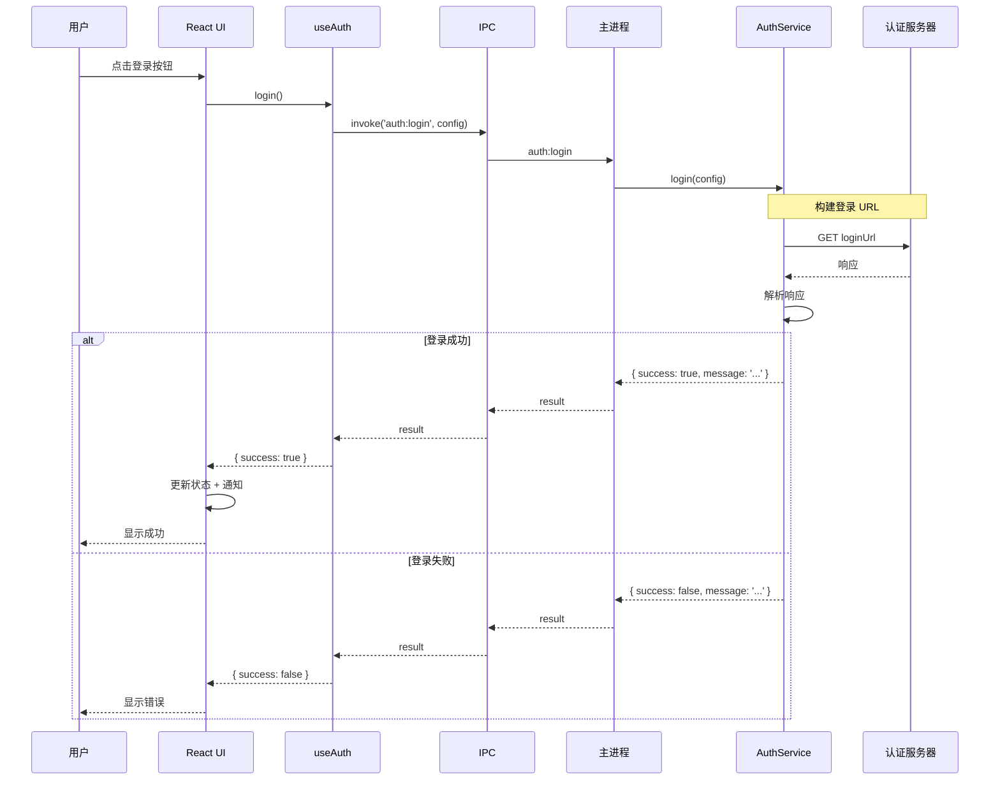

### 10.2 登录状态机

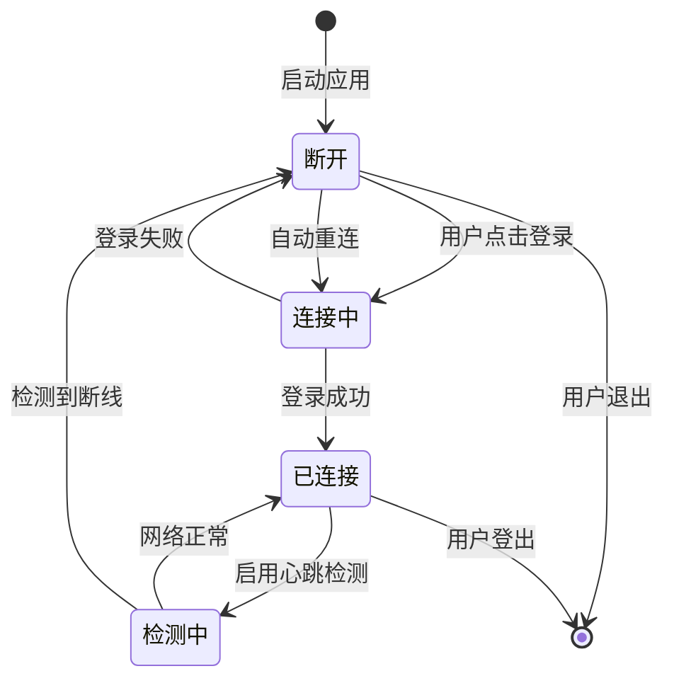

---

## 11. 配置模型

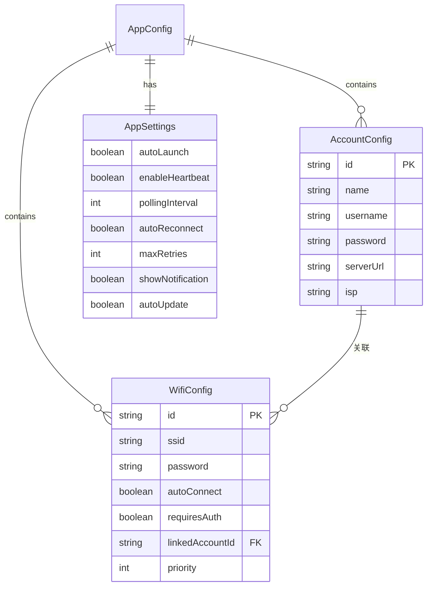

---

## 12. 安全架构

```mermaid
flowchart TB
    subgraph Storage["密码存储"]
        DesktopS["electron-store + safeStorage"]
        MobileS["async-storage + keychain"]
    end

    subgraph Logging["日志脱敏"]
        Mask["敏感字段过滤"]
    end

    subgraph Isolation["上下文隔离"]
        Preload["preload.ts 最小化 API"]
    end

    subgraph Transport["传输安全"]
        HTTPS["HTTPS 请求"]
        Local["本地处理敏感信息"]
    end

    DesktopS --> Storage
    MobileS --> Storage
    Mask --> Logging
    Preload --> Isolation
    HTTPS --> Transport
    Local --> Transport

    style Storage fill:#ffebee
    style Logging fill:#fff8e1
    style Isolation fill:#e3f2fd
    style Transport fill:#e8f5e9
```

---

## 附录: 快速参考

### A. 关键文件路径

| 模块 | 路径 |
|------|------|
| 共享服务 | `packages/shared/src/services/` |
| 类型定义 | `packages/shared/src/types/` |
| 桌面端主进程 | `apps/desktop/electron/` |
| 桌面端UI | `apps/desktop/src/` |
| 移动端 | `apps/mobile/src/` |
| Android原生 | `apps/mobile/android/` |

### B. IPC 通道列表

| 通道 | 功能 |
|------|------|
| `auth:*` | 登录/登出 |
| `account:*` | 账户管理 |
| `wifi:*` | WiFi 配置 |
| `config:*` | 配置读写 |
| `network:*` | 网络状态 |
| `log:*` | 日志操作 |
| `tray:*` | 托盘控制 |
| `notify:*` | 通知管理 |
| `updater:*` | 更新检查 |

---

*文档版本: 1.0*
*最后更新: 2026-01-02*
