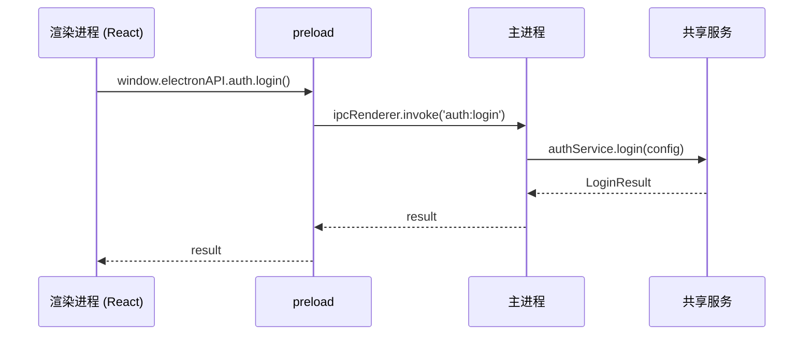
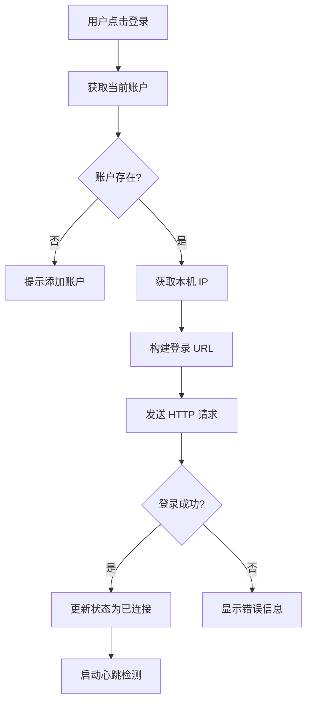
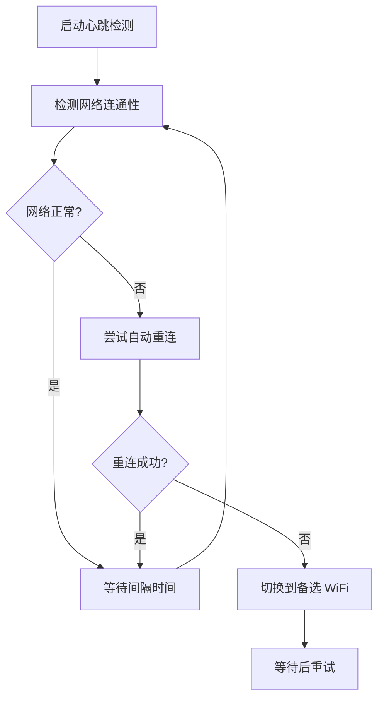

# NetMate 项目详解

> 本文档详细解释 NetMate 项目的结构设计、文件内容和核心逻辑。

---

## 目录

1. [项目概述](#1-项目概述)
2. [目录结构](#2-目录结构)
3. [核心设计模式](#3-核心设计模式)
4. [packages/shared 详解](#4-packagesshared-详解)
5. [apps/desktop 详解](#5-appsdesktop-详解)
6. [apps/mobile 详解](#6-appsmobile-详解)
7. [核心逻辑流程](#7-核心逻辑流程)
8. [设计决策说明](#8-设计决策说明)

---

## 1. 项目概述

### 1.1 是什么

NetMate 是一个**跨平台校园网自动登录工具**，支持：
- **Windows / macOS**: Electron 桌面应用
- **Android**: React Native 移动应用

### 1.2 核心功能

| 功能 | 描述 |
|------|------|
| 自动登录 | 连接 WiFi 后自动完成认证 |
| 多账户管理 | 支持多个校园网账户 |
| 多 WiFi 配置 | 为不同 WiFi 配置不同认证方式 |
| 心跳检测 | 定期检查网络连通性 |
| 自动重连 | 断线后自动重新登录 |
| WiFi 切换 | 按优先级自动切换网络 |

### 1.3 技术栈

```
+-------------------------------------------------------------+
|                     Desktop (Electron)                      |
|  React 18 + TypeScript + Vite + Zustand                     |
+-------------------------------------------------------------+
|                     Mobile (React Native)                   |
|  React Native 0.83 + TypeScript + Metro                     |
+-------------------------------------------------------------+
|                     Shared Core Layer                       |
|  TypeScript + tsup (ESM + CJS)                              |
+-------------------------------------------------------------+
```

---

## 2. 目录结构

```
TUST-CampusNetwork-Login/
+-- apps/                          # Application Layer
|   +-- desktop/                   # Desktop (Electron)
|   |   +-- electron/              # Main process code
|   |   |   +-- main.ts            # App entry
|   |   |   +-- preload.ts         # Preload script
|   |   |   +-- ipc/               # IPC handlers
|   |   |   +-- services/          # Platform services
|   |   +-- src/                   # Renderer process (React)
|   |       +-- main.tsx           # React entry
|   |       +-- App.tsx            # Root component
|   |       +-- pages/             # Page components
|   |       +-- hooks/             # Custom Hooks
|   |       +-- components/        # UI components
|   |
|   +-- mobile/                    # Mobile (React Native)
|       +-- src/
|       |   +-- App.tsx            # App entry
|       |   +-- screens/           # Screens
|       |   +-- hooks/             # Custom Hooks
|       |   +-- native/            # Native module bridge
|       |   +-- context/           # State management
|       +-- android/               # Android native code
|
+-- packages/                      # Shared packages
|   +-- shared/                    # Shared core layer
|       +-- src/
|       |   +-- services/          # Core services
|       |   +-- types/             # Type definitions
|       |   +-- utils/             # Utility functions
|       |   +-- models/            # Data models
|       |   +-- constants/         # Constants
|       +-- package.json
|
+-- docs/                          # Documentation
+-- shell/                         # Reference scripts
+-- pnpm-workspace.yaml            # Workspace config
```

---

## 3. 核心设计模式

### 3.1 为什么用 Monorepo？

**问题**: 桌面端和移动端需要共享核心业务逻辑，但各自需要不同的平台实现。

**解决方案**: 使用 pnpm workspace + packages/shared

```
+-------------------------------------------------------------+
|                      apps/desktop                           |
|              Depends on @repo/shared                        |
|                         |                                   |
|              Platform-specific impl                         |
|  (electron-store, system-tray, auto-launch, etc)            |
+-------------------------------------------------------------+
|                      apps/mobile                            |
|              Depends on @repo/shared                        |
|                         |                                   |
|              Platform-specific impl                         |
|  (async-storage, Android Service, etc)                      |
+-------------------------------------------------------------+
|                   packages/shared                           |
|              Platform-agnostic core logic                   |
|  (Login protocol, network detection, account/WiFi mgmt)     |
+-------------------------------------------------------------+
```

**优势**:
- 避免代码重复
- 统一业务逻辑
- 便于维护和测试

### 3.2 平台适配器模式

**问题**: 同一个功能在不同平台有不同的实现方式。

**解决方案**: 定义接口，平台层实现

```typescript
// packages/shared/src/services/StorageAdapter.ts
export interface StorageAdapter {
  get<T>(key: string): Promise<T | null>;
  set<T>(key: string, value: T): Promise<void>;
  remove(key: string): Promise<void>;
  clear(): Promise<void>;
}

// 桌面端实现 (apps/desktop/electron/services/store.ts)
export function createElectronStorage(): StorageAdapter {
  // 使用 electron-store + safeStorage
}

// 移动端实现 (使用 async-storage)
export function createMobileStorage(): StorageAdapter {
  // 使用 @react-native-async-storage
}
```

### 3.3 IPC 通信模式 (桌面端)

**问题**: Electron 主进程和渲染进程隔离，不能直接通信。

**解决方案**: IPC (Inter-Process Communication)

```
+----------------------+         IPC         +----------------------+
|     Renderer         |  <----------------  |      Main Process    |
|   (React UI)         |                     |  (Node.js)           |
|                      |                     |                      |
|  useAuth.ts          |  ipcRenderer.invoke |  ipc/auth.ts         |
|  useNetwork.ts       |  ->                 |  ipc/network.ts      |
|  ...                 |                     |  ...                 |
+----------------------+                     +----------------------+
```

### 3.4 服务容器模式

**问题**: 多个服务之间存在依赖关系。

**解决方案**: 集中创建和管理服务

```typescript
// apps/desktop/electron/main.ts
async function initServices() {
  // 1. 创建存储
  const storage = createElectronStorage();

  // 2. 创建配置管理器（依赖存储）
  const configManager = createConfigManager(storage);

  // 3. 创建业务服务（依赖配置管理器）
  const accountManager = createAccountManager(configManager);
  const wifiManager = createWifiManager(configManager);

  // 4. 返回服务集合
  return {
    authService,
    configManager,
    accountManager,
    wifiManager,
    networkDetector,
    logger,
  };
}
```

---

## 4. packages/shared 详解

### 4.1 结构

```
packages/shared/src/
+-- index.ts                    # Export entry
+-- services/                   # Core services
|   +-- index.ts               # Service exports
|   +-- AuthService.ts         # Login auth
|   +-- NetworkDetector.ts     # Network detection
|   +-- AccountManager.ts      # Account management
|   +-- WifiManager.ts         # WiFi config management
|   +-- ConfigManager.ts       # Config management
|   +-- RetryPolicy.ts         # Retry strategy
|   +-- StorageAdapter.ts      # Storage interface
+-- types/                      # Type definitions
|   +-- index.ts
|   +-- auth.ts                # Auth types
|   +-- config.ts              # Config types
|   +-- network.ts             # Network types
|   +-- log.ts                 # Log types
+-- utils/                      # Utility functions
|   +-- index.ts
|   +-- urlEncode.ts           # URL encoding
|   +-- httpClient.ts          # HTTP client
|   +-- validator.ts           # Validators
+-- models/                     # Data models
|   +-- index.ts
|   +-- Logger.ts              # Logger model
+-- constants/                  # Constants
    +-- index.ts
    +-- defaults.ts            # Default values
    +-- errors.ts              # Error codes
```

### 4.2 AuthService (登录认证服务)

**文件**: `packages/shared/src/services/AuthService.ts`

**职责**:
- 构建登录 URL
- 解析登录响应
- 执行登录/登出请求

**核心方法**:

```typescript
class AuthService {
  // 构建登录 URL
  buildLoginUrl(config: LoginConfig): string {
    // 1. 根据 ISP 添加账号前缀
    const userAccount = username + prefix; // @cmcc, @cucc 等

    // 2. 构建查询参数
    const params = {
      user_account: userAccount,
      user_password: password,
      wlan_user_ip: ip,
      // ... 其他参数
    };

    // 3. 返回完整 URL
    return `${serverUrl}/eportal/portal/login?${queryString}`;
  }

  // 解析响应
  parseLoginResponse(response: string): LoginResult {
    // 响应格式: dr1009({"result":1,"msg":"成功"})
    const jsonMatch = response.match(/dr1009\((.*)\)/);
    return JSON.parse(jsonMatch[1]);
  }

  // 执行登录
  async login(config: LoginConfig): Promise<LoginResult> {
    const url = this.buildLoginUrl(config);
    const response = await httpGet(url);
    return this.parseLoginResponse(response);
  }
}
```

**设计原因**:
- **URL 构建分离**: 便于测试和维护
- **ISP 前缀映射**: 支持多种运营商
- **响应解析**: 处理特定格式的响应

### 4.3 NetworkDetector (网络检测服务)

**文件**: `packages/shared/src/services/NetworkDetector.ts`

**职责**:
- 检测网络连通性
- 定期轮询检查
- 回调通知状态变化

```typescript
class NetworkDetector {
  private pollingTimer: Timer | null = null;

  // 检测网络连通性
  async checkConnectivity(): Promise<boolean> {
    try {
      // 尝试访问外网
      await httpGet('http://www.baidu.com', { timeout: 5000 });
      return true;
    } catch {
      return false;
    }
  }

  // 启动轮询
  startPolling(interval: number, callback: NetworkCallback): void {
    this.stopPolling(); // 先停止

    const check = async () => {
      const isConnected = await this.checkConnectivity();
      callback(isConnected);

      // 继续轮询
      this.pollingTimer = setTimeout(check, interval);
    };

    check();
  }

  // 停止轮询
  stopPolling(): void {
    if (this.pollingTimer) {
      clearTimeout(this.pollingTimer);
      this.pollingTimer = null;
    }
  }
}
```

### 4.4 AccountManager (账户管理服务)

**文件**: `packages/shared/src/services/AccountManager.ts`

**职责**:
- 账户的增删改查
- 当前账户切换
- 关联 WiFi 配置

```typescript
class AccountManager {
  constructor(private configManager: ConfigManager) {}

  getAccounts(): AccountConfig[] {
    return this.configManager.getConfig().accounts;
  }

  addAccount(account: AccountConfig): AccountConfig {
    const config = this.configManager.getConfig();
    config.accounts.push(account);
    this.configManager.update({ accounts: config.accounts });
    return account;
  }

  removeAccount(id: string): void {
    const config = this.configManager.getConfig();
    config.accounts = config.accounts.filter(a => a.id !== id);
    this.configManager.update({ accounts: config.accounts });
  }

  switchAccount(id: string): AccountConfig | null {
    const config = this.configManager.getConfig();
    const account = config.accounts.find(a => a.id === id);
    if (account) {
      this.configManager.update({ currentAccountId: id });
    }
    return account || null;
  }
}
```

### 4.5 ConfigManager (配置管理服务)

**文件**: `packages/shared/src/services/ConfigManager.ts`

**职责**:
- 加载/保存配置
- 配置更新
- 存储适配器桥接

```typescript
class ConfigManager {
  private config: AppConfig | null = null;

  constructor(private storage: StorageAdapter) {}

  async load(): Promise<void> {
    this.config = await this.storage.get<AppConfig>('config') || defaultConfig;
  }

  async save(): Promise<void> {
    if (this.config) {
      await this.storage.set('config', this.config);
    }
  }

  getConfig(): AppConfig {
    if (!this.config) {
      throw new Error('配置未加载');
    }
    return this.config;
  }

  async update(partial: Partial<AppConfig>): Promise<void> {
    if (!this.config) throw new Error('配置未加载');
    this.config = { ...this.config, ...partial };
    await this.save();
  }
}
```

---

## 5. apps/desktop 详解

### 5.1 结构

```
apps/desktop/
+-- electron/                    # Main process (Node.js)
|   +-- main.ts                  # App entry
|   +-- preload.ts               # Preload script
|   +-- ipc/                     # IPC handlers
|   |   +-- index.ts             # Registration entry
|   |   +-- auth.ts              # Login auth
|   |   +-- account.ts           # Account management
|   |   +-- wifi.ts              # WiFi config
|   |   +-- config.ts            # Config R/W
|   |   +-- network.ts           # Network status
|   |   +-- log.ts               # Log operations
|   |   +-- tray.ts              # Tray control
|   |   +-- auto-launch.ts       # Auto launch
|   |   +-- notification.ts      # Notifications
|   |   +-- updater.ts           # Update checker
|   |   +-- channels.ts          # Channel definitions
|   |
|   +-- services/                # Platform services
|       +-- store.ts             # Storage service
|       +-- network.ts           # Network info
|       +-- wifi-detector.ts     # WiFi detection
|       +-- wifi-switcher.ts     # WiFi switching
|       +-- tray.ts              # System tray
|       +-- auto-launch.ts       # Auto launch
|       +-- notification.ts      # System notifications
|       +-- auto-reconnect.ts    # Auto reconnect
|       +-- updater.ts           # Auto updater
|
+-- src/                         # Renderer process (React)
    +-- main.tsx                 # React entry
    +-- App.tsx                  # Root component
    +-- vite-env.d.ts            # Vite types
    +-- pages/                   # Pages
    |   +-- Home.tsx             # Home page
    |   +-- Settings.tsx         # Settings page
    |   +-- Logs.tsx             # Logs page
    |   +-- About.tsx            # About page
    +-- hooks/                   # Custom Hooks
    |   +-- index.ts
    |   +-- useAuth.ts           # Auth state
    |   +-- useAccounts.ts       # Account management
    |   +-- useWifiConfigs.ts    # WiFi config
    |   +-- useConfig.ts         # Config R/W
    |   +-- useNetwork.ts        # Network status
    |   +-- useLogs.ts           # Log management
    +-- components/              # UI components
    |   +-- Sidebar.tsx          # Sidebar
    |   +-- StatusCard.tsx       # Status card
    |   +-- ...
    +-- types/
        +-- electron.d.ts        # Electron type extensions
```

### 5.2 main.ts (应用入口)

**文件**: `apps/desktop/electron/main.ts`

**职责**:
1. 初始化所有服务
2. 注册 IPC 处理器
3. 创建应用窗口
4. 启动后台服务
5. 管理应用生命周期

```typescript
app.whenReady().then(async () => {
  // 1. 初始化服务
  const services = await initServices();

  // 2. 注册 IPC 处理器
  registerAllIPC(services);

  // 3. 创建平台服务
  const trayService = createTrayService(iconDir, callbacks);
  const autoReconnectService = createAutoReconnectService(services, callbacks);
  const notificationService = createNotificationService(iconDir);

  // 4. 启动后台服务
  startBackgroundServices(services, pollingInterval, autoReconnectService);

  // 5. 创建窗口
  createWindow();
});
```

### 5.3 IPC 处理器设计

**为什么需要 IPC?**

Electron 的主进程和渲染进程运行在不同的上下文：
- **主进程**: Node.js 环境，可以访问文件系统、系统 API
- **渲染进程**: 浏览器环境，沙箱化

**IPC 通信流程**:



**示例: 登录 IPC 处理**

```typescript
// apps/desktop/electron/ipc/auth.ts
ipcMain.handle(IPC_CHANNELS.AUTH_LOGIN, async (event) => {
  // 1. 获取当前账户
  const account = accountManager.getCurrentAccount();
  if (!account) return { success: false, message: '未选择账户' };

  // 2. 获取网络信息
  const networkInfo = getNetworkInfo();

  // 3. 调用共享服务
  authService.setServerUrl(account.serverUrl);
  const result = await authService.login({ ...account, ...networkInfo });

  // 4. 通知渲染进程状态变化
  const win = BrowserWindow.fromWebContents(event.sender);
  win?.webContents.send(IPC_EVENTS.AUTH_STATUS_CHANGED, status);

  return result;
});
```

### 5.4 平台服务

**为什么需要平台服务?**

共享服务是平台无关的，但有些功能需要调用系统 API：

```typescript
// apps/desktop/electron/services/network.ts
export function getNetworkInfo(): NetworkInfo {
  // 获取本机 IP 地址
  // Windows: ipconfig
  // macOS: ifconfig

  return {
    ipv4: '10.10.xxx.xxx',
    ipv6: '::1',
    mac: '00:1a:2b:3c:4d:5e',
  };
}
```

### 5.5 React Hooks 设计

**为什么用 Hooks?**

1. **逻辑复用**: 将认证、网络等逻辑封装为 Hook
2. **状态管理**: 使用 useState 管理本地状态
3. **IPC 调用**: 通过 window.electronAPI 调用主进程

```typescript
// apps/desktop/src/hooks/useAuth.ts
export function useAuth() {
  const [status, setStatus] = useState<AuthStatus>('idle');
  const [loading, setLoading] = useState(false);

  const login = useCallback(async () => {
    setLoading(true);
    const result = await window.electronAPI.auth.login();
    setStatus(result.success ? 'authenticated' : 'failed');
    setLoading(false);
    return result;
  }, []);

  return { status, loading, login };
}
```

---

## 6. apps/mobile 详解

### 6.1 结构

```
apps/mobile/src/
+-- App.tsx                      # App entry
+-- main.tsx                     # React Native entry
+-- screens/                     # Screens
|   +-- HomeScreen.tsx           # Home screen
|   +-- SettingsScreen.tsx       # Settings screen
|   +-- LogsScreen.tsx           # Logs screen
+-- hooks/                       # Custom Hooks
|   +-- index.ts
|   +-- useNetwork.ts            # Network status
|   +-- useHeartbeat.ts          # Heartbeat detection
|   +-- useAutoReconnect.ts      # Auto reconnect
+-- native/                      # Native module bridge
|   +-- index.ts
|   +-- WifiModule.ts            # WiFi control
|   +-- BackgroundService.ts     # Background service
|   +-- Notification.ts          # Notifications
|   +-- AutoStart.ts             # Auto start
|   +-- AppUpdater.ts            # App updater
+-- context/                     # State management
|   +-- AppContext.tsx           # App context
|   +-- index.ts
+-- components/                  # UI components
+-- constants/                   # Constants
|   +-- theme.ts                 # Theme
+-- types/                       # Type definitions
```

### 6.2 原生模块桥接

**为什么需要原生模块桥接?**

React Native 提供 JavaScript API，但某些功能需要调用原生代码：

```typescript
// apps/mobile/src/native/WifiModule.ts
import { NativeModules } from 'react-native';
const { WifiModule } = NativeModules;

export const connectToWifi = async (ssid: string, password: string): Promise<boolean> => {
  try {
    const result = await WifiModule.connect(ssid, password);
    return result === 'SUCCESS';
  } catch (error) {
    return false;
  }
};

// apps/mobile/android/app/src/main/java/.../WifiModule.kt
@ReactMethod
fun connect(ssid: String, password: String, promise: Promise) {
  val wifiManager = context.getSystemService(Context.WIFI_SERVICE) as WifiManager
  // 调用 Android WiFi API
}
```

### 6.3 后台服务

**为什么需要后台服务?**

Android 应用进入后台后可能会被系统杀死，需要前台服务保持运行：

```typescript
// apps/mobile/src/native/BackgroundService.ts
import { NativeModules, Platform } from 'react-native';

export function startBackgroundService(): void {
  if (Platform.OS === 'android') {
    NativeModules.BackgroundService.start();
  }
}

// Android 原生代码
@ReactMethod
fun start() {
  val intent = Intent(this, BackgroundService::class.java);
  startForegroundService(intent);
}
```

---

## 7. 核心逻辑流程

### 7.1 登录流程



### 7.2 心跳检测流程



### 7.3 自动重连逻辑

```typescript
// apps/desktop/electron/services/auto-reconnect.ts
class AutoReconnectService {
  async reconnect(): Promise<boolean> {
    for (let attempt = 1; attempt <= this.maxRetries; attempt++) {
      this.logger.info(`重连尝试 ${attempt}/${this.maxRetries}`);

      // 1. 获取当前账户
      const account = this.accountManager.getCurrentAccount();
      if (!account) return false;

      // 2. 获取网络信息
      const networkInfo = getNetworkInfo();

      // 3. 尝试登录
      this.authService.setServerUrl(account.serverUrl);
      const result = await this.authService.login({
        ...account,
        ...networkInfo,
      });

      if (result.success) {
        this.onSuccess?.();
        return true;
      }

      // 4. 等待后重试
      await this.sleep(this.calculateDelay(attempt));
    }

    this.onFailed?.();
    return false;
  }
}
```

---

## 8. 设计决策说明

### 8.1 为什么用 TypeScript?

**决策**: 整个项目使用 TypeScript

**原因**:
1. **类型安全**: 编译时发现错误
2. **代码提示**: IDE 智能提示
3. **重构方便**: 重构时更有信心
4. **文档作用**: 类型即文档

### 8.2 为什么用 Zustand 而不是 Redux?

**决策**: 桌面端使用 Zustand

**原因**:
1. **简洁**: API 简单易用
2. **轻量**: 包体积小
3. **灵活**: 不强制使用特定模式
4. **够用**: 满足当前需求

### 8.3 为什么分离共享层?

**决策**: 创建 packages/shared 包

**原因**:
1. **代码复用**: 桌面端和移动端共享核心逻辑
2. **一致性**: 确保行为一致
3. **测试便利**: 共享代码更容易测试
4. **维护成本**: 只需维护一份代码

### 8.4 为什么用 IPC 而不是直接调用?

**决策**: 主进程和渲染进程通过 IPC 通信

**原因**:
1. **安全性**: 渲染进程无法直接访问系统 API
2. **隔离性**: 一个进程崩溃不影响另一个
3. **架构清晰**: 职责分离

### 8.5 为什么用事件驱动?

**决策**: 使用事件通知状态变化

**原因**:
1. **解耦**: 生产者和消费者不直接依赖
2. **灵活**: 可以有多个监听者
3. **异步**: 非阻塞处理

```typescript
// 发送事件
win?.webContents.send(IPC_EVENTS.AUTH_STATUS_CHANGED, 'authenticated');

// 监听事件
window.electronAPI.onAuthStatusChanged((status) => {
  setStatus(status);
});
```

---

## 附录

### A. 关键文件速查

| 文件 | 职责 |
|------|------|
| `packages/shared/src/services/AuthService.ts` | 登录认证核心逻辑 |
| `packages/shared/src/services/NetworkDetector.ts` | 网络连通性检测 |
| `packages/shared/src/services/ConfigManager.ts` | 配置管理 |
| `apps/desktop/electron/main.ts` | 桌面端入口 |
| `apps/desktop/electron/ipc/auth.ts` | 登录 IPC 处理 |
| `apps/desktop/src/hooks/useAuth.ts` | 认证 Hook |
| `apps/mobile/src/App.tsx` | 移动端入口 |

### B. 常用命令

```bash
# 开发
pnpm dev:desktop    # 启动桌面端开发
pnpm dev:mobile     # 启动移动端开发

# 构建
pnpm build:shared   # 构建共享包
pnpm build:desktop  # 构建桌面端

# 代码质量
pnpm lint           # 检查代码
pnpm format         # 格式化代码
```

---

*文档版本: 1.0*
*最后更新: 2026-01-02*
